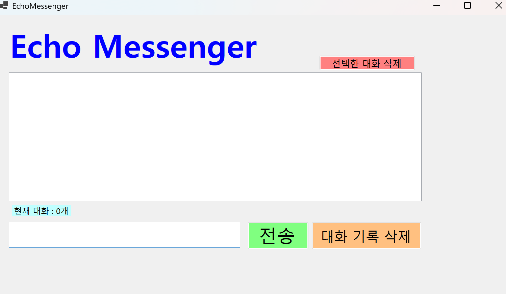
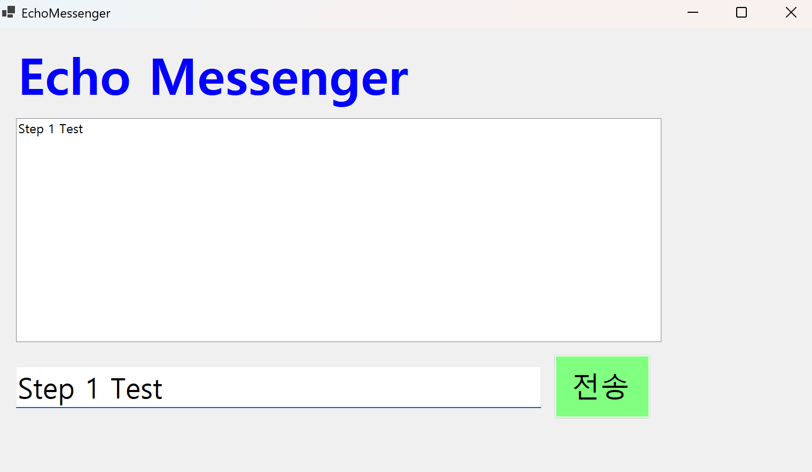
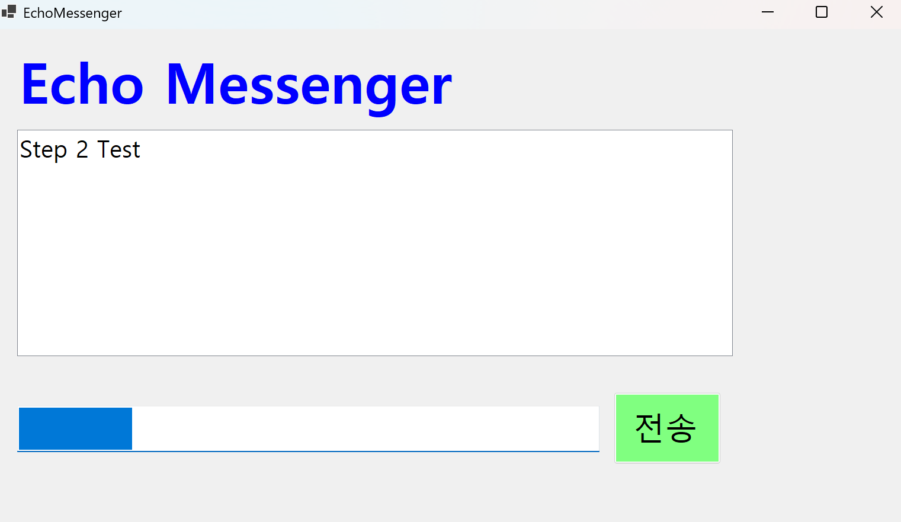
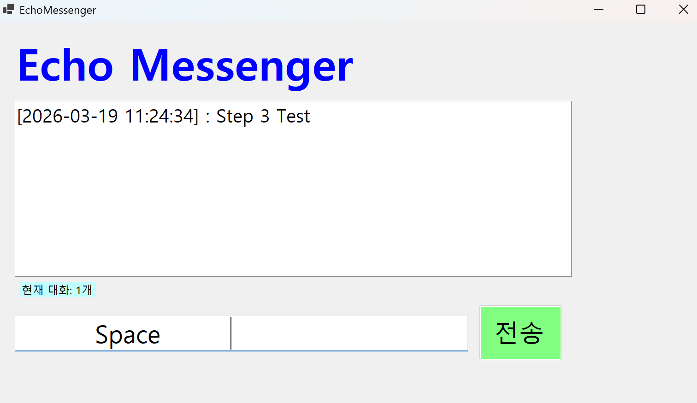
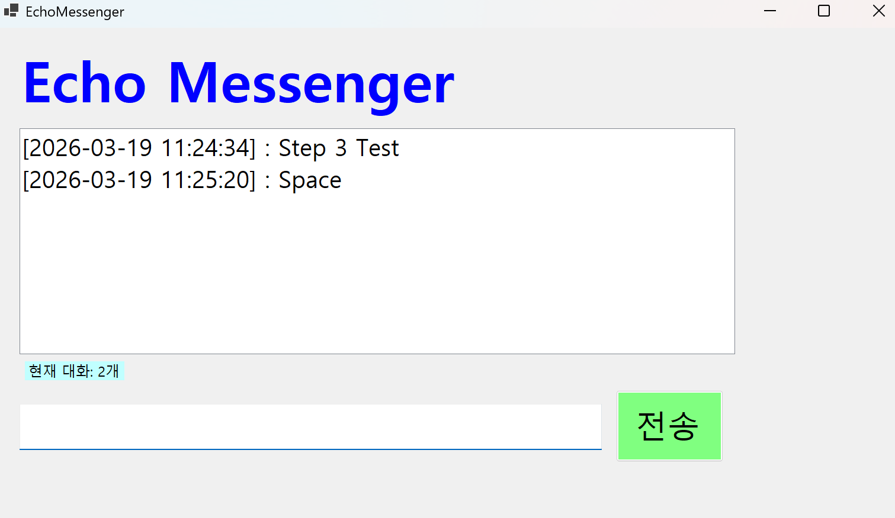
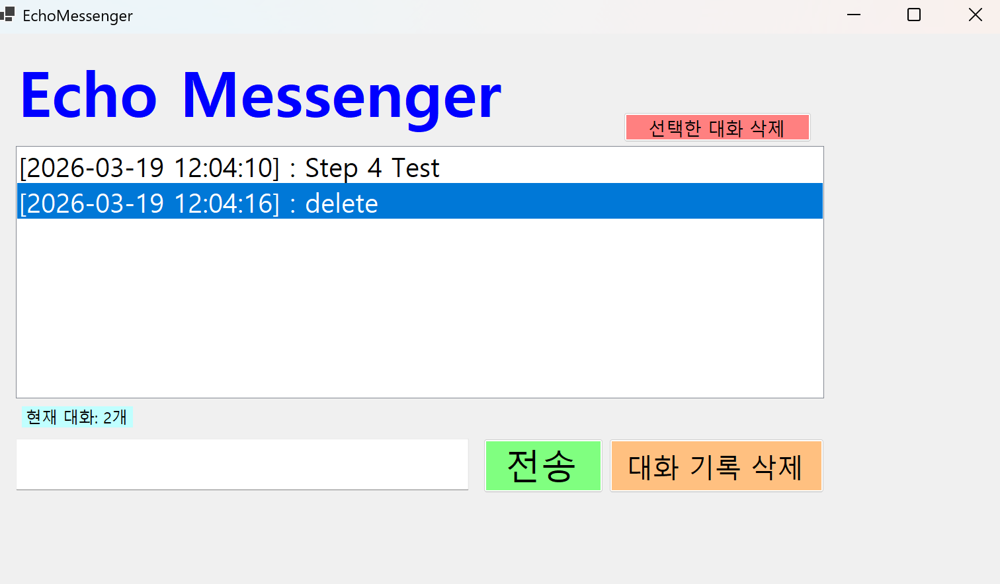
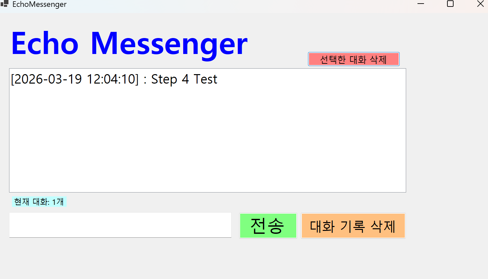
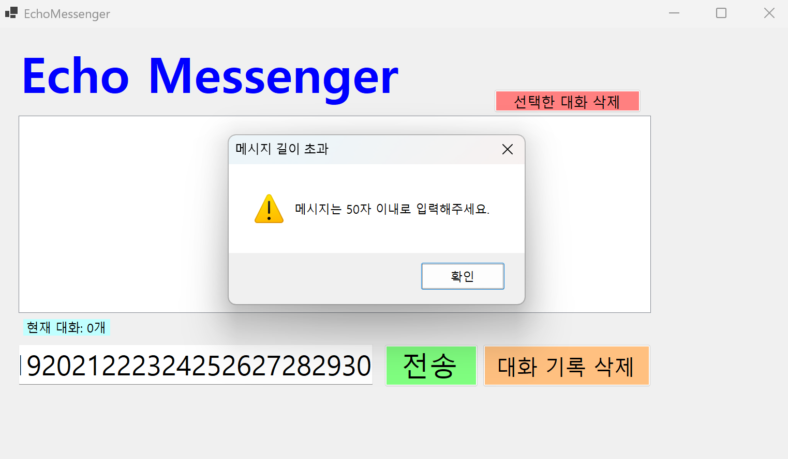

# (C# 코딩) 에코 메신저

## 개요
- C# 프로그래밍 학습

- 1줄 소개 : 사용자 키보드 입력을 받아서 처리하는 프로그램

- 사용한 플랫폼 :
  - ```C#```, ```.NET Windows Forms```, ```Visual Studio 2026```, ```GitHub``` 
  
- 사용한 컨트롤 :  
    - ```Label, ListBox, TextBox, Button```
    
- 사용한 기술과 구현한 기능 :
  - ```Visual Studio```를 이용하여 UI 디자인
  - ```String``` 클래스를 이용한 사용자 입력 데이터 처리
  - ```DateTime``` 클래스를 이용한 현재시간 정보 구하기
  - ```listbox.Items.Add(msg)```,```listbox.Items.RemoveAt(index)```,```listbox.SelectedIndex```로 ListBox의 Item 관리
  - ```string.IsNullOrWhiteSpace(string)```,```string.Trim()```으로 문자열의 null과 공백 검사 및 공백제거
  - ```textbox.Clear()```와 ```textbox.Focus()```로 TextBox 초기화 및 포커스 설정
  - ```if (e.KeyCode == Keys.Enter)```로 Enter 입력 이벤트 관리
 
- 화면 구성 : 
  
  

## 실행 화면 (과제1)

- 과제1 코드의 실행 스크린샷

  
  
```전송 시 TextBox 초기화```

  - 과제 내용
    - ```Label```(표시), ```TextBox```(입력), ```Button```(전송), ```ListBox```(대화창)를 적절히 배치
    - 전송 버튼 클릭 시 TextBox의 텍스트를 ListBox의 항목(Items)로 추가
    - 추가 직후 TextBox의 내용을 비워 다음 입력 준비
      
  - 구현 내용과 기능 설명
    - 입력창에 메시지 입력하고 전송 버튼을 누르면 메시지가 리스트 박스에 표시된다.
    - 계속 반복하면 메시지가 리스트 박스에 한 줄 씩 계속 추가된다.
    - 추가 내용이 많아지면 리스트 박스에 스크롤바가 자동으로 생기고 스크롤된다.
    
  - 사용한 기술과 구현한 기능
    - ```Label, TextBox, Button, ListBox``` 컨트롤을 활용한 UI 구성
    - ```listbox.Items.Add(msg)```로 ListBox에 메시지 추가

## 실행 화면 (과제2)

- 과제2 코드의 실행 스크린샷

   

- 과제 내용
    - 입력창의 기존 메시지 지우기
    - 입력창에 입력 포커스 갖다 놓기
    - 엔터키로 전송하기
    - 입력 방어
      
- 구현 내용과 기능 설명
    - 전송이 끝나면 입력창에 남겨진 기존 메시지를 삭제
    - 전송 후에 마우스로 입력창을 다시 클릭하지 않아도 되도록 커서를 자동으로 입력창에 위치
    - 마우스 클릭 대신 키보드의 Enter 키를 눌러도 메시지가 전송
    -  내용이 없는 빈 문자열이나 공백(Space)만 있을 때는 메시지가 전송되지 않도록 방지
   
- 사용한 기술과 구현한 기능
    - ```textbox.Clear()```를 활용해 입력창 초기화
    - ```textbox.Focus()```를 활용해 입력창 포커스
    - ```textbox```의 ```KeyDown``` 이벤트에 ```if(e.KeyCode == Keys.Enter)```를 활용해 기존 전송 로직 실행
    - ```string.IsNullOrWhiteSpace()```를 활용해 빈 문자열 또는 공백 
    
## 실행 화면 (과제3)

- 과제3 코드의 실행 스크린샷

    
    
    

- 과제 내용
    - 타임스탬프 추가
    - 메시지 카운팅
    - 문자열 정제

- 구현 내용과 기능 설명
    - 메시지 앞에 현재 시간([14:20:05])을 자동으로 결합하여 리스트에 출력
    -  현재 리스트에 쌓인 총 메시지 개수를 계산하여 하단 Label에 실시간으로 업데이트 (예 : "현재 대화: 12개“)
    - 사용자가 입력한 메시지의 앞뒤 불필요한 공백을 Trim() 함수로 제거하여 저장

- 사용한 기술과 구현한 기능
    - ```DateTime```을 활용해 ```$"[{DateTime.Now:yyyy-MM-dd HH:mm:ss}] : {msg}"```로 리스트에 출력
    - ```ListBox``` 하단에 ```Label```을 추가하고 ```listbox.Items.Count```를 활용해 실시간 업데이트
    - ```string.Trim()```을 활용해 앞뒤 불필요한 공백 제거 
   
## 실행 화면 (과제4)

- 과제4 코드의 실행 스크린샷

     
    
    
    
    

- 과제 내용
    - 선택 항목 삭제
    - 전체 초기화
    - 글자 수 제한
  
- 구현 내용과 기능 설명
    -  ListBox에서 특정 메시지를 마우스로 클릭하고 '삭제' 버튼을 누르면 해당 항목만 목록에서
제거 (단, 선택하지 않고 삭제 시 발생하는 에러를 예외 처리)
    - '대화 기록 삭제' 버튼을 클릭하면 리스트의 모든 내용을 한 번에 삭제
    - 입력창에 글자 수를 50자로 제한하고, 초과시 사용자에게 경고 메시지를 띄우거나 전송을 차
단

- 사용한 기술과 구현한 기능
    - ```ListBox```의 ```SelectedIndex```를 활용해 특정 메시지 선택 후 ```Items.RemoveAt()```로 삭제
    - ```ListBox```의 ```Items.Clear()```를 활용해 대화 기록 전체 삭제
    - 전송 로직에서 공백 검사 후 ```if(msg.Length > 50)```를 활용해 글자 수 제한 및 경고 메시지를 ```MessageBox```로 출력

## 어려웠거나 새로 배운 점
  - ```IsNullOrWhiteSpace```을 이용하면 ```str.length >=0```같은 조건문으로 쓰지 않아도 되고 더 정확해서 편리했다.
  - TextBox를 초기화할 떄 ```textbox.Text = ""```가 아닌 ```textbox.Clear()```로 간단하게 바꿀 수 있었다.
  - 메시지의 개수를 표시하는 하단 Label을 업데이트하는 로직이 너무 중복되었는데 이 로직을 따로 메서드로 분리헤서 가독성을 높혔다.
  - 각 컨트롤들을 이벤트마다 새로 할당하는 것이 마음에 안들었는데 전역변수로 선언해서 한번만 할당하도록 바꿨다.
